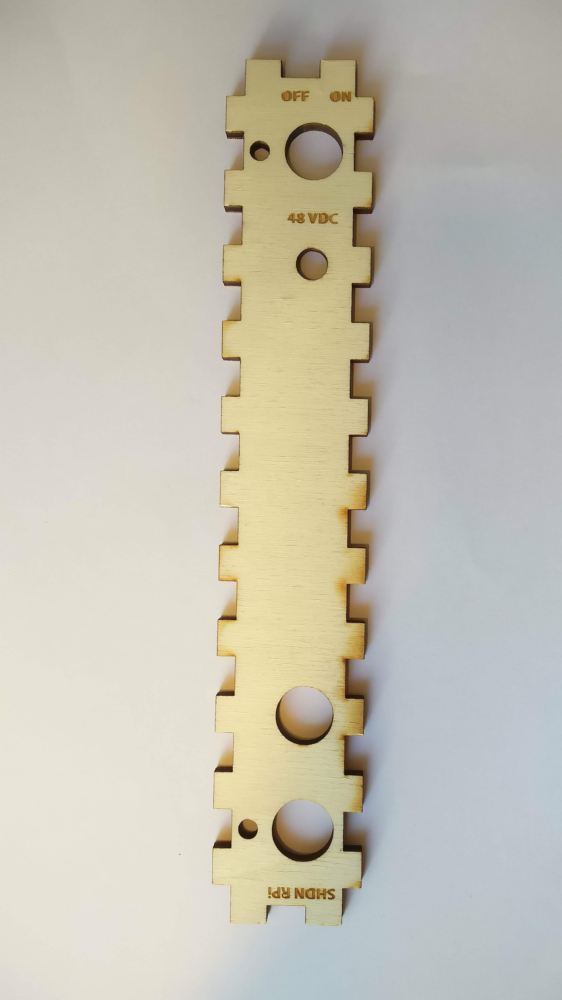
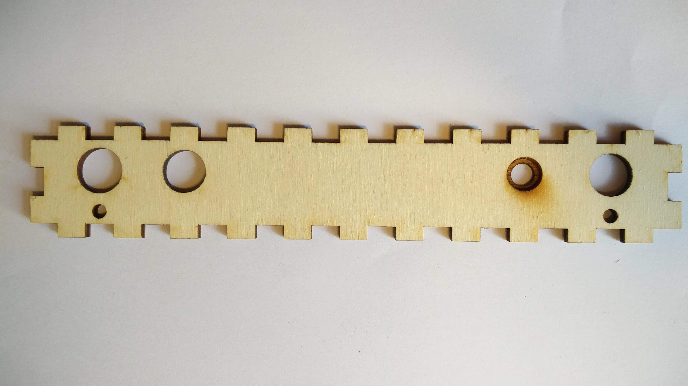
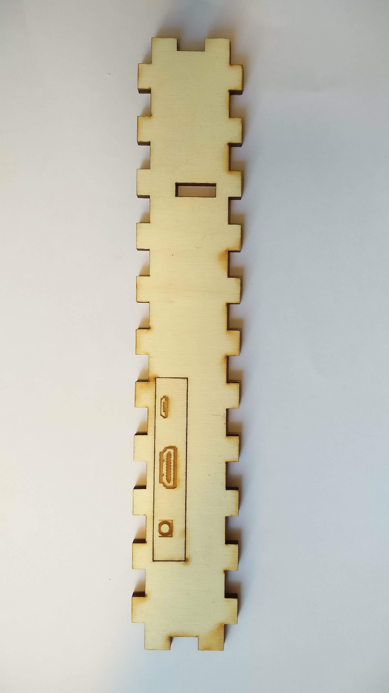
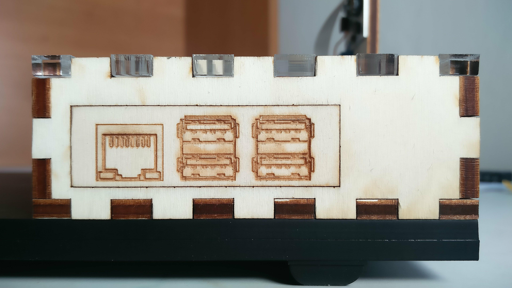
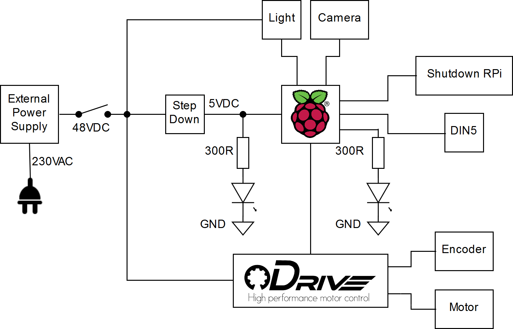

# Introduction

Our motivation for developing the Ball In Hoop model was to demonstrate non-trivial, complex control algorithms on a simple, easy-to-make and compact model. As the name suggests, the model consists of the ball and the hoop. The ball can freely rotate in the hoop and the hoop is attached to a motor which allows us to exert a torque on the hoop. The goal is to damp the undesired oscillations of the ball. In other words, the goal is to calculate a torque acting against the oscillations based on the measured position of the ball.

This repository should help you to make this model on your own. It provides a step-by-step guide. Please bear in mind that the whole project is still in development. That means there is always a plenty of possible improvements and even we ourselves made several changes and deflected slightly from the guide written below.

The theoretical background of the model is explained in following paper: <https://goo.gl/vkwKiH>

To explore our previous version of the model and its capabilities please check these videos:

<https://www.youtube.com/watch?v=484GN4KBQnc>

<https://www.youtube.com/watch?v=8FaNk6C2ckM>

# Design

You can see the arrangement of the model in the following picture:

(img/Model2)

An acrylic board bears an electronics box and a motor holder. Concerning the hoop holder, there are ODrive Driver, ODrive Motor (bearing the hoop) and matching encoder attached to it. The electronics box includes Raspberry Pi 3b+, a step-down converter (from 48VDC to 5VDC), a smaller box for balls and a light module holder (which bears the Raspberry Pi Camera V1).

## Acrylic board

It actually consists of two acrylics (dimensions: 450x230x5mm). They stand on four small rubber legs. There are eight holes in the board - seven mounting holes and one hole for cables. The displacement of the holes can be seen here:

<https://a360.co/2OJNwOs○>

## Box

The electronics box is made of 5mm thick plywood (later, we made the top part of acrylic). Dimensions: 230x110x40mm. We designed the box in Fusion 360 and used the sketches to cut the sides of the box in laser cutter. In this box there is an inner box for balls, 85x60mm. You may examine the 3D model here:

<https://a360.co/2OJnGtP>

### Front side

Taking from left to right, there is a 15mm switch hole, beneath this switch hole is a 4.9mm hole for indication led, then there is an 8mm hole for input voltage, a 15mm hole for a DIN connector (it provides access to Raspberry Pi pins), a 16mm hole for a Raspberry Pi shutdown button and lastly a second hole for an indication LED. On the inner side of the front side, there is a 11mm hole partly engraved around the 8mm voltage connector in order to better fit in the connector.

### Left and rear side

Because we need access to RaspberryPi connectors, we made holes in the left and  the rear side and cut out rectangles to fit in them tightly.

### Components

- ON/OFF switch, panel mount
- DC power connector, jack, 2.1mm x 5.5mm, panel mount
- DIN 5 female connector, panel mount, 180°
- button, panel mount

## Light

The whole concept of a model light differs completely from the previous version of the model (*version 1*). Previously, we dismantled a LED bulb and used its components to make the model light. Now, we decided to make the light on our own. Thus, we have made a schematic and a PCB in Autodesk Eagle PCB designer.

Please visit <https://github.com/aa4cc/raspicam-lamp>.

## Motor holder

The motor holder is mounted to the acrylic through three holes (5mm diameter).

Furthermore, there are holes for ODrive, encoder, motor and also a hole which allows a motor axis go through the holder.

Here you can see the 3D model of the holder:

<https://a360.co/2QvQi7p>

## Hoop

The outer diameter of the hoop is 225mm and the thickness is 30mm. The hoop is designed so that you can fit two rubber O-rings inside.

## Electronics

