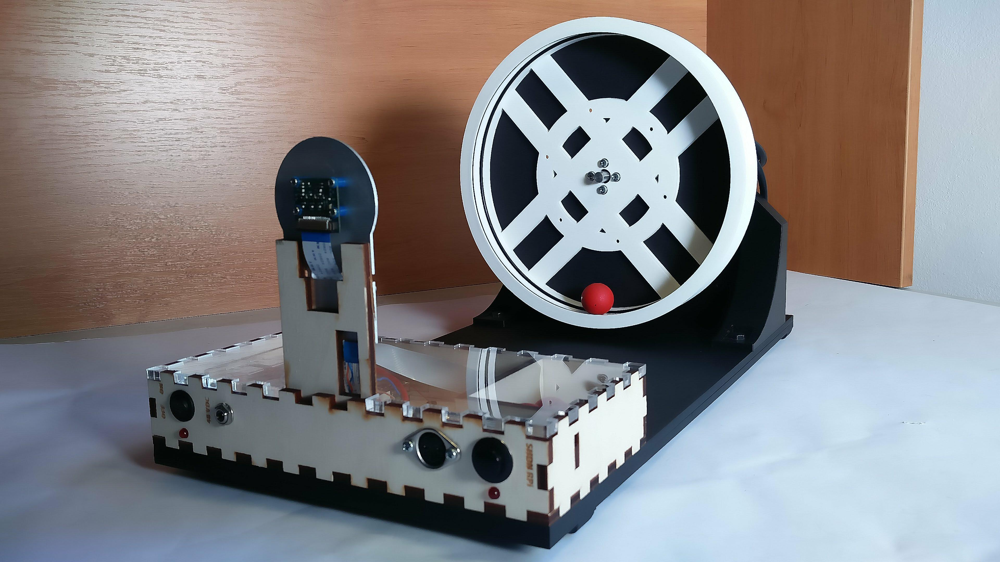

# Introduction

Flying Ball in Hoop is a laboratory model we developed for teaching and showing what advanced control systems can achieve. As the name suggests, the model consists of a ball and a hoop. The ball can freely rotate in the hoop and the hoop is attached to a motor which allows us to exert a torque on the hoop. One can pose and solve various tasks for this model. The tasks can vary from the simpler ones, like stabilizing the ball down in the hoop regardless external disturbances, to more complex ones, like looping the loop or even letting the ball fall from the hoop and land in an inner collector. For more details and some theoretical background see our paper [1].

We designed this laboratory model with reproducibility in mind; every at least a bit experienced tinkerer should be able to build this model based on the step-by-step guide presented on this web page. Nevertheless, please bear in mind that the whole project is still in development. That means there is always plenty of room for improvements and even we made several changes and deflected slightly from the guide written below.

You can see the previous version of this model in action in the following videos:

Loop-the-loop              |  Flying ball
:-------------------------:|:-------------------------:
  |  

# Design

You can see the arrangement of the model in the following picture:

An acrylic board bears an electronics box and a motor holder. Concerning the motor holder, there are ODrive Driver, ODrive Motor (bearing the hoop) and matching encoder attached to it. The electronics box includes Raspberry Pi 3b+, a step-down converter (from 48VDC to 5VDC), a smaller box for balls and a light module holder (which bears the Raspberry Pi Camera V1).

Voltage comes through power connector which is (via a switch) wired to the light module, ODrive and step-down. The step-down is connected to the indication LED and also powers the Raspberry Pi which is connected to the light module, shutdown button, DIN5 connector, RasPi Camera, indication LED and ODrive. ODrive is connected (apart from power and Raspberry) to the motor, encoder and breaking resistor.

## Acrylic base board

It actually consists of two acrylics (dimensions: 450x230x5mm). They stand on four small rubber legs. There are eight holes in the board - seven mounting holes and one hole for cables. You can find the 3D model of the base board here:

<https://a360.co/2OJNwOs○>

## Box

The electronics box is made of 5mm thick plywood (later, we made the top part of acrylic). Dimensions: 230x110x40mm. We designed the box in Fusion 360 and used the sketches to cut the sides of the box in laser cutter. In this box there is an inner box for balls, 85x60mm. You may examine the 3D model here:

<https://a360.co/2OJnGtP>

### Front side

Taking from left to right, there is a 15mm switch hole, beneath this switch hole is a 4.9mm hole for indication led, then there is an 8mm hole for input voltage, a 15mm hole for a DIN connector (it provides access to Raspberry Pi pins), a 16mm hole for a Raspberry Pi shutdown button and lastly a second hole for an indication LED. On the inner side of the front side, there is a 11mm hole partly engraved around the 8mm voltage connector in order to better fit in the connector.

### Left and rear side

Because we need access to RaspberryPi connectors, we made holes in the left and  the rear side and cut out rectangles to fit in them tightly.

### Components

- ON/OFF switch, panel mount
- DC power connector, jack, 2.1mm x 5.5mm, panel mount
- DIN 5 female connector, panel mount, 180°
- button, panel mount

## Light

Please visit <https://github.com/aa4cc/raspicam-lamp>.

## Motor holder

The motor holder is mounted to the acrylic through three holes (5mm diameter).

Furthermore, there are holes for ODrive, encoder, motor and also a hole which allows a motor axis go through the holder.

Here you can see the 3D model of the holder:

<https://a360.co/2QvQi7p>

## Hoop

The outer diameter of the hoop is 225mm and the thickness is 30mm. The hoop is designed so that you can fit two rubber O-rings inside.

# References
[1] M. Gurtner and J. Zemánek, “Ball in double hoop: demonstration model for numerical optimal control *,” IFAC-PapersOnLine, vol. 50, no. 1, pp. 2379–2384, Jul. 2017. Available at [arxiv.org](https://arxiv.org/abs/1706.07333)